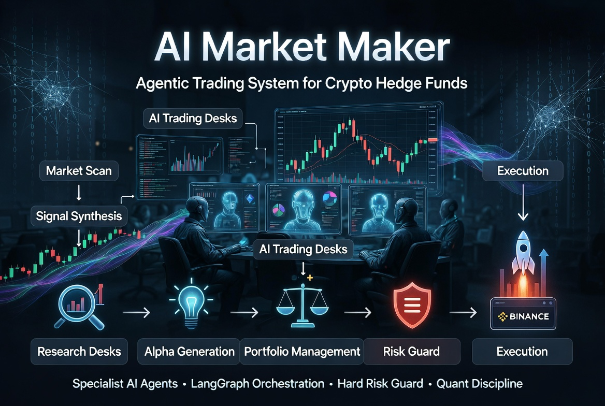

# AI Market Maker: Agentic Trading System for Crypto Hedge Funds

<p align="center">
  
</p>

[](https://github.com/olaxbt/ai-market-maker/stargazers)
[](https://github.com/olaxbt/ai-market-maker/watchers)
[](https://github.com/olaxbt/ai-market-maker/network)
[](./LICENSE)
[](#)
[](./web)

[](https://x.com/olaxbt)
[](https://t.me/OLAXBT_Community)
[](https://www.olaxbt.xyz/)

[Overview](#-overview) | [Quick Start](#quick-start) | [Docs](#setup-details) | [Contributing](#contributing) | [License](#license)

## Overview

**AI-Market-Maker** is an open-source, **hedge-fund-style** trading stack for crypto. It combines **specialist AI trading agents** (acting as trading desks), a **LangGraph** orchestration layer, a **hard Risk Guard veto** before any execution, and quant-grade discipline including centralized policy, benchmarks against buy-and-hold, and full traceability.

Designed to feel like a small professional trading firm — not just another bot.

### Key Features
- Multi-agent workflow with clear desk responsibilities
- Strict **Risk Guard** that can veto any trade
- Quant-style backtesting with built-in benchmarks (excess return vs buy-and-hold)
- Unified agent interface + governance layer
- **OpenClaw-ready packaging** (`SKILL.md` + `manifest.json` + dedicated runners)
- Paper trading on Binance Testnet + rich local backtester
- Modern web dashboard for telemetry and traces
- Clean configuration (JSON policy + env for secrets only)

---

## Goals

**Current (Trading Mode)**  
Fetch real-time data, generate signals through specialist agents, run portfolio logic, apply Risk Guard veto, and execute on Binance Testnet.

**Near-term**  
Full position lifecycle, multi-asset portfolio management, configurable leverage, and improved long/short handling.

**Longer-term**  
Deeper agentic capabilities, better OpenClaw integration, and support for additional execution venues and data sources.

---

## Why This Project Stands Out

- **Real risk governance** — Risk Guard has final veto power, not just logging.
- **Quant discipline** — Every backtest includes clear benchmarks. No hand-waving.
- **Standardized agents** — All agents follow the same `Input → Process → Output → Feedback` contract.
- **Transparency** — Full traces, reasoning logs, and event ledger.
- **Extensibility** — Built with LangGraph, clean personas, and OpenClaw skill packaging.

## System Architecture

The workflow mimics a small hedge fund:

1. **Research Desks** — Market Scan, Technical Analysis, Statistical Alpha, Sentiment
2. **Alpha Generation** — Signal synthesis and thesis building
3. **Portfolio Management** — Risk-weighted allocation and trade sizing
4. **Risk Guard** — Final safety layer (can veto everything)
5. **Execution** — Only proceeds if Risk Guard approves  


See **[docs/langgraph-workflow.md](docs/langgraph-workflow.md)** for the complete graph state, nodes, edges and routing logic.

---

## Quick Start

```bash
# 1. Clone the repo
git clone https://github.com/olaxbt/ai-market-maker.git
cd ai-market-maker

# 2. Install dependencies
pip install uv

# 3. Install TA-Lib first (see installation options in Prerequisites section)
# Example using Conda (recommended for OpenClaw environments):
# wget https://repo.anaconda.com/miniconda/Miniconda3-latest-Linux-x86_64.sh
# bash Miniconda3-latest-Linux-x86_64.sh -b -p $HOME/miniconda
# source $HOME/miniconda/bin/activate
# conda install -y ta-lib -c conda-forge

# 4. Install Python dependencies
uv sync --extra dev
uv run pre-commit install

# 3. Set up environment
cp .env.example .env
# Edit .env with your API keys (Binance Testnet + OpenAI recommended)
#
# Required for the Docker stack:
#   DATABASE_URL=postgresql+psycopg://aimm:aimm@db:5432/aimm
#   AIMM_AUTH_SECRET=<long-random-secret>

# 4. Run the platform stack (recommended): DB + API + worker + web
# Requires Docker Desktop / docker compose.
#
docker compose -f docker-compose.prod.yml up --build -d

# 5. Run migrations (first time, and after schema changes)
docker compose -f docker-compose.prod.yml run --rm api alembic upgrade head

# 6. Open the dashboard
# http://localhost:3000
```

Open http://localhost:3000 to view the dashboard.

Note: first boot may show an empty Leaderboard/Signals until you run a backtest (Nexus → Research) or publish provider results/signals.

For CLI-only trading mode:
```bash
uv run python src/main.py
```

---

## Setup Details

### Prerequisites
- Python 3.11+
- [uv](https://github.com/astral-sh/uv)
- **TA-Lib (C library + Python wrapper)** - see installation options below
- Binance Testnet API keys (for paper trading)
- OpenAI API key (optional, enables LLM nodes)
- (Optional) Nexus Skills API access

#### TA-Lib Installation Options

**Option 1: Conda (Recommended)**
```bash
# Install Miniconda if not already installed
wget https://repo.anaconda.com/miniconda/Miniconda3-latest-Linux-x86_64.sh
bash Miniconda3-latest-Linux-x86_64.sh -b -p $HOME/miniconda
source $HOME/miniconda/bin/activate
conda install -y ta-lib -c conda-forge
```

**Option 2: System Package Manager**
```bash
# Ubuntu/Debian
sudo apt-get update
sudo apt-get install -y ta-lib

# macOS (Homebrew)
brew install ta-lib

# Then install Python wrapper
pip install ta-lib
```

**Option 3: Source Compilation**
```bash
wget http://prdownloads.sourceforge.net/ta-lib/ta-lib-0.4.0-src.tar.gz
tar -xzf ta-lib-0.4.0-src.tar.gz
cd ta-lib/
./configure --prefix=/usr/local
make
sudo make install
pip install ta-lib
```

**Note for OpenClaw Users:** If running in OpenClaw environment without sudo privileges, use Option 1 (Conda) as shown in the CI workflow.

### Configuration Philosophy
- **Policy & universe** → `config/policy.default.json` and `config/app.default.json` (single source of truth)
- **Secrets** → only in `.env`

Detailed docs:
- [`docs/configuration.md`](docs/configuration.md)
- [`docs/policy-schema.md`](docs/policy-schema.md)
- [`docs/run-modes.md`](docs/run-modes.md)

### Testing

```bash
# Default unit tests (no network)
uv run pytest -q

# Full agentic E2E tests
uv run pytest -q tests/test_agentic_trading_e2e.py tests/test_tier0_consensus.py
```

---

## Agents (Desks)

- **Market Scan** — New listings, momentum, universe coverage
- **Technical TA Engine** — Pattern recognition, MACD, indicators
- **Statistical Alpha Engine** — Factor and cross-sectional signals
- **Sentiment & Narrative** — News, retail hype, whale behavior
- **Risk Management** — Position sizing, volatility-based limits
- **Portfolio Management** — Multi-asset allocation and proposal generation
- **Risk Guard** — Hard veto layer before execution

All agents follow a standardized interface defined in `src/agents/base_agent.py`.

---

## Backtesting & Research Expectations

Every backtest automatically includes:
- Performance metrics (Sharpe, Sortino, Profit Factor, etc.)
- Benchmark vs. **buy-and-hold** (spot move + equity curve)
- Excess return calculation
- Full trade ledger and forced risk exits
- Multi-asset portfolio analysis

**Important**: A single profitable backtest is **not** proof of edge. Always validate across multiple regimes and out-of-sample periods.

### Running Backtests

```bash
# Using the OpenClaw runner
python3 openclaw/scripts/claw_runner.py --backtest

# With custom parameters
python3 openclaw/scripts/claw_runner.py --backtest --symbols "BTC/USDT,ETH/USDT,SOL/USDT" --steps 100

# Direct Python execution
uv run python -m backtest.run_demo --symbols BTC/USDT,ETH/USDT,SOL/USDT --steps 100 --online --exchange binance
```

### Example Backtest Results

The default configuration (using multiple symbols and conservative risk parameters) typically produces results like:

```
Trade count: 17
Total return: 14.95%
Excess return vs BTC buy & hold: +30.25%
Sharpe ratio: 1.79
Maximum drawdown: 11.84%
Win rate: 62.5%
```

These results reflect:
- Multi-asset diversification (BTC, ETH, SOL)
- Conservative position sizing and risk limits
- Automated benchmark comparison
- Full trade transparency and risk event logging

---

## Web UI

A Next.js dashboard is included for viewing:
- Live agent traces and reasoning
- Backtest results
- Topology visualization
- Prompt editing (where applicable)

Run with:
```bash
cd web && npm install && npm run dev
```

---

## Project Structure

```
ai-market-maker/
├── src/                    # Core Python logic
│   ├── agents/             # Individual trading desks
│   ├── tools/              # Exchange, TA, sentiment tools
│   ├── backtest/           # Backtesting engine
│   └── api/                # FastAPI endpoints
├── web/                    # Next.js dashboard
├── openclaw/               # OpenClaw skill definitions
├── config/                 # Default policy and app config
├── docs/                   # Detailed documentation
├── tests/                  # Test suite
└── .env.example
```

## OpenClaw Integration

This project includes complete OpenClaw support with dedicated tooling for agentic trading workflows.

### Skill Package
```
openclaw/
├── SKILL.md              # Skill documentation
├── manifest.json         # OpenClaw manifest
├── scripts/              # Dedicated runners
│   ├── claw_runner.py    # Main entry point
│   └── verify_installation.sh  # Dependency checker
└── examples/             # Usage examples
```

### Installation
```bash
# From OpenClaw
claw install https://github.com/olaxbt/ai-market-maker

# Or locally
claw skill install ./openclaw
```

### Features
- Dedicated runner with automatic environment setup
- Installation verification script
- Pre-configured for OpenClaw environments
- Full compatibility with Claw skill system
- Multi-language documentation support (English, Korean)
- Complete examples for different usage scenarios
- Optimized default settings for good backtest results


## Using with Nexus on BNB Chain

You can run this service as part of the OlaXBT *Nexus* stack and settle usage directly on *BNB Chain (BSC / BNB Smart Chain)*.

Fund your Nexus-connected wallet with BNB or supported stablecoins on BNB Chain, then buy credits through the Nexus interface; all metered usage is settled on BNB Chain with low fees, and can later be expanded to opBNB or Greenfield–aligned workflows.

This lets agents and trading tools consume data and actions through Nexus while keeping payments and accounting native to the BNB Chain ecosystem.

---

## Contributing

We welcome contributions! Please read [`CONTRIBUTING.md`](CONTRIBUTING.md) first.

Growth is driven by issues and pull requests. See the open issues for current priorities.

---

## License

[GNU Affero General Public License v3.0](https://www.gnu.org/licenses/agpl-3.0.html) — see [`LICENSE`](LICENSE). If you modify this software and run it as a network service, AGPL obligations (including source offer to users) may apply; read the license carefully.

---

**Built with LangGraph • FastAPI • Next.js • TA-Lib**

Ready to experiment with serious agentic trading infrastructure.
