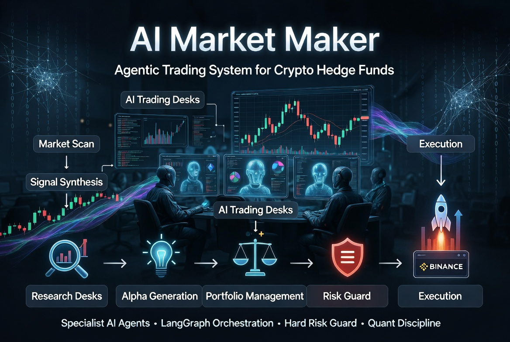

# AI Market Maker: Agentic Trading System for Crypto Hedge Funds

<p align="center">
  
</p>

[](https://github.com/olaxbt/ai-market-maker/stargazers)
[](https://github.com/olaxbt/ai-market-maker/watchers)
[](https://github.com/olaxbt/ai-market-maker/network)
[](./LICENSE)
[](#)
[](./web)

[](https://x.com/olaxbt)
[](https://t.me/OLAXBT_Community)
[](https://www.olaxbt.xyz/)

[Overview](#-overview) | [Quick Start](#quick-start) | [Docs](#setup-details) | [Contributing](#contributing) | [License](#license)

## Overview

**AI-Market-Maker** is an open-source, **hedge-fund-style** trading stack for crypto. It combines **specialist AI trading agents** (acting as trading desks), a **LangGraph** orchestration layer, a **hard Risk Guard veto** before any execution, and quant-grade discipline including centralized policy, benchmarks against buy-and-hold, and full traceability.

Designed to feel like a small professional trading firm — not just another bot.

### Key Features
- Multi-agent workflow with clear desk responsibilities
- Strict **Risk Guard** that can veto any trade
- Quant-style backtesting with built-in benchmarks; **agentic LLM required** (`OPENAI_API_KEY` or `ATLASCLOUD_API_KEY`)
- Unified agent interface + governance layer
- **OpenClaw-ready packaging** (`SKILL.md` + `manifest.json` + dedicated runners)
- Paper trading on Binance Testnet + rich local backtester; Hyperliquid adapter (dry-run) via OMS layer
- Modern web dashboard for telemetry and traces
- Clean configuration (JSON policy + env for secrets only)

### Sponsorship — Atlas Cloud

<p align="center">
  <a href="https://www.atlascloud.ai/?utm_source=ai-market-maker&utm_medium=github&utm_campaign=ai-market-maker">
    <picture>
      <source media="(prefers-color-scheme: dark)" srcset="./assets/atlas-cloud-logo-white.svg" />
      <source media="(prefers-color-scheme: light)" srcset="./assets/atlas-cloud-logo-black.svg" />
      
    </picture>
  </a>
</p>

**[Atlas Cloud](https://www.atlascloud.ai/?utm_source=ai-market-maker&utm_medium=github&utm_campaign=ai-market-maker)** is a full-modal AI inference platform that gives developers a single AI API to access video generation, image generation, and LLM APIs. Instead of managing multiple vendor integrations, you connect once and get unified access to 300+ curated models across all modalities.
Check out Atlas Cloud's new coding plan promotion for more budget-friendly API access: https://www.atlascloud.ai/console/coding-plan

---

## Goals

**Current (Trading Mode)**  
Fetch real-time data, generate signals through specialist agents, run portfolio logic, apply Risk Guard veto, and execute on Binance Testnet.

**Near-term**  
Full position lifecycle, multi-asset portfolio management, configurable leverage, and improved long/short handling.

**Longer-term**  
Deeper agentic capabilities, better OpenClaw integration, and support for additional execution venues and data sources.

---

## Why This Project Stands Out

- **Real risk governance** — Risk Guard has final veto power, not just logging.
- **Quant discipline** — Every backtest includes clear benchmarks. No hand-waving.
- **Standardized agents** — All agents follow the same `Input → Process → Output → Feedback` contract.
- **Transparency** — Full traces, reasoning logs, and event ledger.
- **Extensibility** — Built with LangGraph, clean personas, and OpenClaw skill packaging.

## System Architecture

Rough flow (LangGraph):

1. **Market scan + Tier-0 desks** — macro, TA, pattern, stats, narrative, flow, …
2. **Risk + desk debate** — risk context, then bull/bear evidence
3. **Signal arbitrator** — optional per-desk LLM (`agent_llm`), then **weight assigner** fuses scores into BUY/SELL/HOLD
4. **Portfolio** — proposal → Risk Guard veto → execute


Weights/thresholds: [`docs/weighted-arbitrator.md`](docs/weighted-arbitrator.md). Graph notes: [`docs/langgraph-workflow.md`](docs/langgraph-workflow.md).

---

## Quick Start

```bash
# 1. Clone the repo
git clone https://github.com/olaxbt/ai-market-maker.git
cd ai-market-maker

# 2. Install dependencies
pip install uv

# 3. Install TA-Lib first (see installation options in Prerequisites section)
# Example using Conda (recommended for OpenClaw environments):
# wget https://repo.anaconda.com/miniconda/Miniconda3-latest-Linux-x86_64.sh
# bash Miniconda3-latest-Linux-x86_64.sh -b -p $HOME/miniconda
# source $HOME/miniconda/bin/activate
# conda install -y ta-lib -c conda-forge

# 4. Install Python dependencies
uv sync --extra dev
uv run pre-commit install

# 5. Set up environment
cp .env.example .env
# Edit .env — set OPENAI_API_KEY or ATLASCLOUD_API_KEY (agentic runs need a key)

# 6. Run the platform stack: DB + migrate + API + worker + web
# Requires Docker Desktop. Futu OpenD optional (`--profile with-futu`).
#
docker compose up --build -d

# 7. Open the dashboard
# http://localhost:3000/console?view=research
# http://localhost:3000/leaderboard
# http://localhost:3000/get-started
```

Open http://localhost:3000 to view the dashboard.

Migrations run automatically on first `docker compose up` (service `migrate`).
First boot may show an empty Leaderboard until you run a backtest (Nexus → **Research**) or publish results.

For CLI-only trading mode:
```bash
uv run python src/main.py
```

### Agentic LLM setup

Agentic path needs a key (no silent fallback). Either:

```bash
OPENAI_API_KEY=...
# optional: OPENAI_BASE_URL / OPENAI_MODEL
```

or, if `OPENAI_API_KEY` is unset:

```bash
ATLASCLOUD_API_KEY=...
ATLASCLOUD_BASE_URL=https://api.atlascloud.ai/v1
ATLASCLOUD_MODEL=deepseek-ai/deepseek-v4-pro
```

Coding plan: https://www.atlascloud.ai/console/coding-plan — more env notes in [`docs/configuration.md`](docs/configuration.md).

---

## Hosted Leaderboard (API-only public deployment)

If you want a lightweight **public API** for published results/signals (no full Nexus UI):

```bash
docker compose -f docker-compose.leaderboard.yml up -d --build
```

For the full local portal (Research backtests + console), use plain `docker compose up --build -d` instead.

---

## How to evaluate this repo (developer checklist)

- **Start with the product surface**
  - Put `OPENAI_API_KEY` or `ATLASCLOUD_API_KEY` in `.env`, then open `/console?view=research`.
  - Open `/get-started` for local setup commands.
  - Open `/tools` to browse callable platform endpoints.
- **Run a quick backtest**
  - Use Nexus → Research (or call `POST /backtests/quick`) and confirm:
    - equity + trades ledgers exist under `.runs/backtests/<run_id>/`
- **Inspect a run**
  - Fetch `GET /runs/latest/payload?soft=1` and inspect topology/traces/message log.

## Setup Details

### Prerequisites
- Python 3.11+
- [uv](https://github.com/astral-sh/uv)
- **TA-Lib (C library + Python wrapper)** - see installation options below
- Binance Testnet API keys (for paper trading)
- LLM API key for agentic mode (`OPENAI_API_KEY` or `ATLASCLOUD_API_KEY`)
- (Optional) Nexus Skills API access

#### TA-Lib Installation Options

**Option 1: Conda (Recommended)**
```bash
# Install Miniconda if not already installed
wget https://repo.anaconda.com/miniconda/Miniconda3-latest-Linux-x86_64.sh
bash Miniconda3-latest-Linux-x86_64.sh -b -p $HOME/miniconda
source $HOME/miniconda/bin/activate
conda install -y ta-lib -c conda-forge
```

**Option 2: System Package Manager**
```bash
# Ubuntu/Debian
sudo apt-get update
sudo apt-get install -y ta-lib

# macOS (Homebrew)
brew install ta-lib

# Then install Python wrapper
pip install ta-lib
```

**Option 3: Source Compilation**
```bash
wget http://prdownloads.sourceforge.net/ta-lib/ta-lib-0.4.0-src.tar.gz
tar -xzf ta-lib-0.4.0-src.tar.gz
cd ta-lib/
./configure --prefix=/usr/local
make
sudo make install
pip install ta-lib
```

**Note for OpenClaw Users:** If running in OpenClaw environment without sudo privileges, use Option 1 (Conda) as shown in the CI workflow.

### Configuration Philosophy
- **Policy & universe** → `config/policy.default.json` and `config/app.default.json` (single source of truth)
- **Secrets** → only in `.env`

Detailed docs:
- [`docs/configuration.md`](docs/configuration.md)
- [`docs/policy-schema.md`](docs/policy-schema.md)
- [`docs/run-modes.md`](docs/run-modes.md)

### Testing

```bash
# Default unit tests (no network)
uv run pytest -q

# Full agentic E2E tests
uv run pytest -q tests/test_agentic_trading_e2e.py tests/test_tier0_consensus.py
```

---

## Agents (Desks)

- **Tier-0** — macro (1.1), news (1.2), pattern (2.1), stats (2.2), TA (2.3), retail hype / pro bias / whale / liquidity (3.x–4.x)
- **Market scan, risk, desk debate** — universe + risk context before arbitration
- **Signal arbitrator** — desk LLMs (when `agent_llm`) then weight assigner → `trade_intent`
- **Portfolio** — proposal / execute
- **Risk Guard** — hard veto before execution

Default research weights (`macro_tilt`): 2.3×0.55, 1.1×0.25, 2.1×0.15. Personas in `docs/personas/`; interface in `src/agents/base_agent.py`.

---

## Backtesting & Research Expectations

Every backtest automatically includes:
- Performance metrics (Sharpe, Sortino, Profit Factor, etc.)
- Benchmark vs. **buy-and-hold** (spot move + equity curve)
- Excess return calculation
- Full trade ledger and forced risk exits
- Multi-asset portfolio analysis

**Important**: A single profitable backtest is **not** proof of edge. Always validate across multiple regimes and out-of-sample periods.

### Running Backtests

Run these **from the repository root** (the directory that contains `pyproject.toml`), after `uv sync --extra dev` (or `uv sync`). Requires an LLM key (`OPENAI_API_KEY` / `LLM_API_KEY` or `ATLASCLOUD_API_KEY`). LLM path dependence means re-runs are not bit-identical.

```bash
# One-time: prefetch history for the locked eval window
uv run python -m backtest.bootstrap_showcase --eval-steps 180 --until 2026-07-12

# Offline CSV backtest (loads config/deploy.active.json)
AIMM_BACKTEST_OHLCV_NEXUS=0 AIMM_BACKTEST_LLM_MAX_STEPS=200 uv run python -m backtest.run_demo \
  --symbols 'BTC/USDT,ETH/USDT,SOL/USDT' \
  --steps 180 \
  --until 2026-07-12 \
  --csv-only \
  --timeframe 1d \
  --ticker BTC/USDT
```

OHLCV-derived macro context feeds agent **1.1** in backtest (no live Nexus, no look-ahead).
See [`docs/backtest-data.md`](docs/backtest-data.md) for data layers and future Nexus agent wiring.

Watch **stderr** for the per-bar transcript; stdout ends with JSON metrics;
HTML report at `.runs/backtests/<run_id>/backtest_report.html`.

**TA warmup (default, recommended):** `--steps 180` fetches **230** daily bars (50 warmup + 180 eval).
Warmup bars feed RSI/MACD/ADX context only — **no LLM calls, no trades**. Metrics and benchmark use
the **180 eval** bars only (`summary.json` → `eval_bars`, `ta_warmup_bars`). Override via
`config/app.default.json` `backtest.min_warmup_bars` (default **50**).

Use `--no-warmup` only for fast A/B compares (indicators cold-start on bar 1; not for production reporting).

### Example results (macro_tilt, 50 warmup + 180d eval, `bt_1784467270`)

Reference run: **50-bar TA warmup**, **180 eval bars**, `macro_tilt`, leverage 2.0,
OHLCV-only desk (`AIMM_BACKTEST_OHLCV_NEXUS=0`). Eval window 2025-11-25 → 2026-07-12.
Reference run_id: `bt_1784467270`.

| Metric | Strategy | BTC buy-and-hold |
|--------|----------|------------------|
| Return (eval window) | **+18.8%** | −34.2% |
| Excess vs B&H | **+53.0%** | — |
| Sharpe | **0.91** | — |
| Max drawdown | 18.3% | — |
| Trades | 34 | — |
| Profit factor | **1.39** | — |
| Regimes | bull, bear | — |

Research helpers (period sweep, preset compare) live under `out/scripts/` (gitignored scratch).

**Tuning for paper / research (agentic framework aligned):**

| Knob | Recommendation | Why |
|------|----------------|-----|
| **Desk combo** | `macro_tilt` (`config/deploy.active.json`): 2.3×0.55, 1.1×0.25, 2.1×0.15 | Golden gates; leverage 2.0 |
| **Horizon** | `--steps 180` daily (50 warmup + 180 eval) | Best return/Sharpe balance in period sweep |
| **Period lock** | `--until 2026-07-12` | Pin eval end date when CSV grows |
| **Data** | `bootstrap_showcase --eval-steps 180 --until 2026-07-12` → `--csv-only` | Enough history for offline reruns |
| **OHLCV context** | `AIMM_BACKTEST_OHLCV_NEXUS=0` | OHLCV-only desk; defers live Nexus |
| **Nexus desks** | Defer 1.2/3.x/4.x to later PR | Need historical feeds — see `docs/backtest-data.md` |
| **Symbols** | BTC + ETH + SOL | Multi-asset book; transcript defaults to `--ticker` only |
| **Transcript** | `AIMM_BACKTEST_TERMINAL_ALL_SYMBOLS=1` optional | Show all three symbols per bar (verbose) |
| **Stress test** | `--steps 365` separately | Full-year bear-market eval; report PF even if &lt; 1 |

```bash
# Optional: explicit desk list (same as macro_tilt default)
AIMM_LLM_AGENTS=2.3,2.1,1.1 NEXUS_DISABLE=1 AIMM_BACKTEST_LLM_MAX_STEPS=200 \
  uv run python -m backtest.run_demo \
  --symbols 'BTC/USDT,ETH/USDT,SOL/USDT' --steps 180 --until 2026-07-12 --online --timeframe 1d --ticker BTC/USDT
```

If you see `ModuleNotFoundError: No module named 'backtest'`, you are not in the repo root or dependencies are not installed (`uv sync`).
If your `.env` sets `AIMM_STRATEGY_PRESET`, it overrides `config/app.default.json` strategy defaults; unset it to use shipped `app.default.json` presets.

### How the default backtest works (agentic)

Each bar invokes the full LangGraph workflow with **LLM-active** desks:

| Piece | Behavior |
|-------|----------|
| **Arbitrator mode** | Default `agent_llm` — per-agent LLM inference (`infer_agent`) then **weighted convergence** fusion |
| **Portfolio** | Always `llm_portfolio_proposal` / `llm_portfolio_execute` (no rule-based fallback) |
| **OHLCV context** | Market scan + Tier-0 math feed LLM prompts; 1.1 gets OHLCV-derived macro (`AIMM_BACKTEST_OHLCV_NEXUS=1`) |
| **No fallback layer** | Graph `trade_intent` only — no HOLD→BUY/SELL override |
| **Fill model** | Signal on completed bars; fill at bar open; TP/SL at bar close |
| **Terminal output** | Per-bar desk CoT on stderr (on by default in backtest; disable with `AIMM_BACKTEST_TERMINAL_LOG=0`) |
| **Audit receipts** | `tier0_summary` in iterations (on by default in backtest; disable with `AIMM_BACKTEST_VERBOSE_RECEIPTS=0`) |

Optional: `config/deploy.active.json` with `agents[id].llm_enabled` or `AIMM_LLM_AGENTS=2.1,2.3` to limit which desks call the LLM.

### Comparison with [TradingAgents](https://github.com/TauricResearch/TradingAgents)

Both are LangGraph multi-agent research scaffolds. Differences that matter for this repo:

| | TradingAgents | AIMM (this repo) |
|---|---------------|------------------|
| Asset class | Equities (Yahoo) | Crypto perps (Binance OHLCV) |
| Backtest model | Date-grid `propagate()` vs next-bar close | Bar-by-bar perp simulator (margin, funding, multi-symbol) |
| Agent fusion | Bull/bear debate → trader → risk → PM | Weighted desk convergence + TA-led gates |
| Artifacts | Decision log, checkpoints | `summary.json`, trades/equity JSONL, HTML report, quality gates |
| Terminal UX | Per-date analyst reports in CLI | Per-bar desk CoT + BUY/SELL/HOLD summary on stderr |

Like TradingAgents, results vary with model and window — report benchmark, sample size, and profit factor honestly.

### Example Backtest Results

Re-run after setting your LLM key — results depend on provider, model, and the rolling `--online` window:

```bash
NEXUS_DISABLE=1 uv run python -m backtest.run_demo \
  --symbols 'BTC/USDT,ETH/USDT,SOL/USDT' \
  --steps 365 --online --timeframe 1d --ticker BTC/USDT
```

Report: `.runs/backtests/<run_id>/backtest_report.html`

**Local parameter sweep** (requires LLM key; compares presets via `deploy_config` in `src/backtest/run_agentic_sweep.py`):

```bash
NEXUS_DISABLE=1 uv run python -m backtest.run_agentic_sweep --showcase
```

Reports: `.runs/evaluations/sweep_<id>/sweep_report.md`

See also: [`docs/weighted-arbitrator.md`](docs/weighted-arbitrator.md) for threshold and alignment-gating details.

---

## Futu OpenD (HK / US Stock Data)

The stack includes a **Futu OpenD adapter** for fetching real-time HK and US stock data and placing simulated (paper) orders.

### Prerequisites
- Futu OpenD must be running locally or on a reachable host.
  Download from [Futu OpenAPI](https://www.futunn.com/OpenAPI) and start the
  gateway on your local machine:
  ```bash
  chmod +x OpenD
  ./OpenD
  ```
  OpenD exposes port 11111 (quote) and 11112 (trade) by default.

### Configuration

```bash
# .env (all have sensible defaults if unset)
FUTU_OPEND_HOST=127.0.0.1       # OpenD host
FUTU_OPEND_QUOTE_PORT=11111     # Quote API port
FUTU_OPEND_TRADE_PORT=11112     # Trade API port
FUTU_DRY_RUN=0                  # 1 = parse only, never send real orders (safe default)
# FUTU_UNLOCK_PWD=              # Required for order placement
```

### Test the connection

```bash
python -c "
from futu import OpenQuoteContext
ctx = OpenQuoteContext(host='127.0.0.1', port=11111)
ret, data = ctx.get_stock_quote('HK.00700')
print('OK' if ret == 0 else 'FAIL', data)
ctx.close()
"
```

### Web Dashboard

Open the Futu dashboard at **`/futu`** (Nexus nav → Futu tab) after starting the web UI.
- Select HK/US tickers from the configured universe.
- View OHLCV candlestick charts (interval: 1h / 1d / 1w).
- Place simulated buy/sell orders (paper trades).
- Falls back to synthetic mock data when OpenD is not available.

---

## Web UI

A Next.js dashboard is included for viewing:
- Live agent traces and reasoning
- Backtest results
- Topology visualization
- Prompt editing (where applicable)
- **Futu stock data and charts**

Run with:
```bash
cd web && npm install && npm run dev
```

---

## Project Structure

```
ai-market-maker/
├── src/                    # Core Python logic
│   ├── agents/             # Individual trading desks
│   ├── tools/              # Exchange, TA, sentiment tools
│   ├── backtest/           # Backtesting engine
│   ├── llm/                # LLM clients (OpenAI-compatible / Atlas)
│   └── api/                # FastAPI endpoints
├── web/                    # Next.js dashboard
├── openclaw/               # OpenClaw skill definitions
├── config/                 # Default policy and app config
├── assets/                 # Branding
├── docs/                   # Detailed documentation
├── tests/                  # Test suite
└── .env.example
```

## OpenClaw Integration

This project includes complete OpenClaw support with dedicated tooling for agentic trading workflows.

### Skill Package
```
openclaw/
├── SKILL.md              # Skill documentation
├── manifest.json         # OpenClaw manifest
├── scripts/              # Dedicated runners
│   ├── claw_runner.py    # Main entry point
│   └── verify_installation.sh  # Dependency checker
└── examples/             # Usage examples
```

### Installation
```bash
# From OpenClaw
claw install https://github.com/olaxbt/ai-market-maker

# Or locally
claw skill install ./openclaw
```

### Features
- Dedicated runner with automatic environment setup
- Installation verification script
- Pre-configured for OpenClaw environments
- Full compatibility with Claw skill system
- Multi-language documentation support (English, Korean)
- Complete examples for different usage scenarios
- Optimized default arbitrator weights (offline-tuned); see [Backtesting](#backtesting--research-expectations)


## Using with Nexus on BNB Chain

You can run this service as part of the OlaXBT *Nexus* stack and settle usage directly on *BNB Chain (BSC / BNB Smart Chain)*.

Fund your Nexus-connected wallet with BNB or supported stablecoins on BNB Chain, then buy credits through the Nexus interface; all metered usage is settled on BNB Chain with low fees, and can later be expanded to opBNB or Greenfield–aligned workflows.

This lets agents and trading tools consume data and actions through Nexus while keeping payments and accounting native to the BNB Chain ecosystem.

---

## Contributing

We welcome contributions! Please read [`CONTRIBUTING.md`](CONTRIBUTING.md) first.

Growth is driven by issues and pull requests. See the open issues for current priorities.

---

## License

[GNU Affero General Public License v3.0](https://www.gnu.org/licenses/agpl-3.0.html) — see [`LICENSE`](LICENSE). If you modify this software and run it as a network service, AGPL obligations (including source offer to users) may apply; read the license carefully.

---

**Built with LangGraph • FastAPI • Next.js • TA-Lib**

Ready to experiment with serious agentic trading infrastructure.
